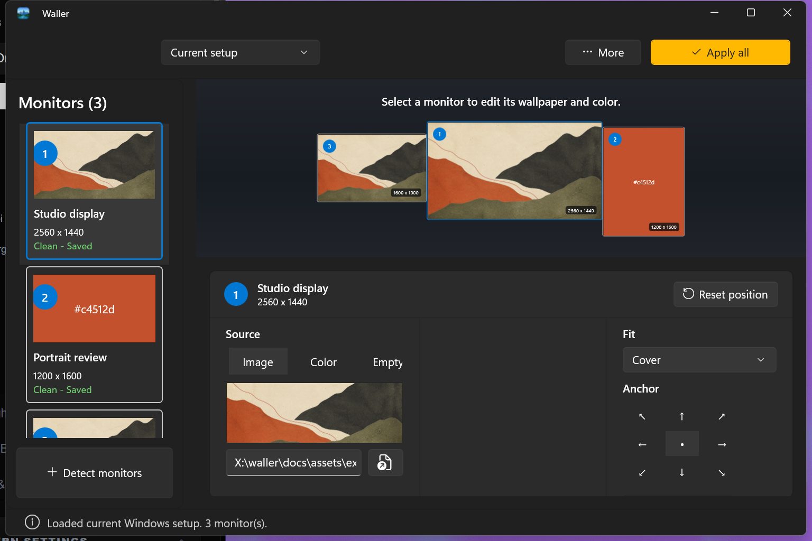
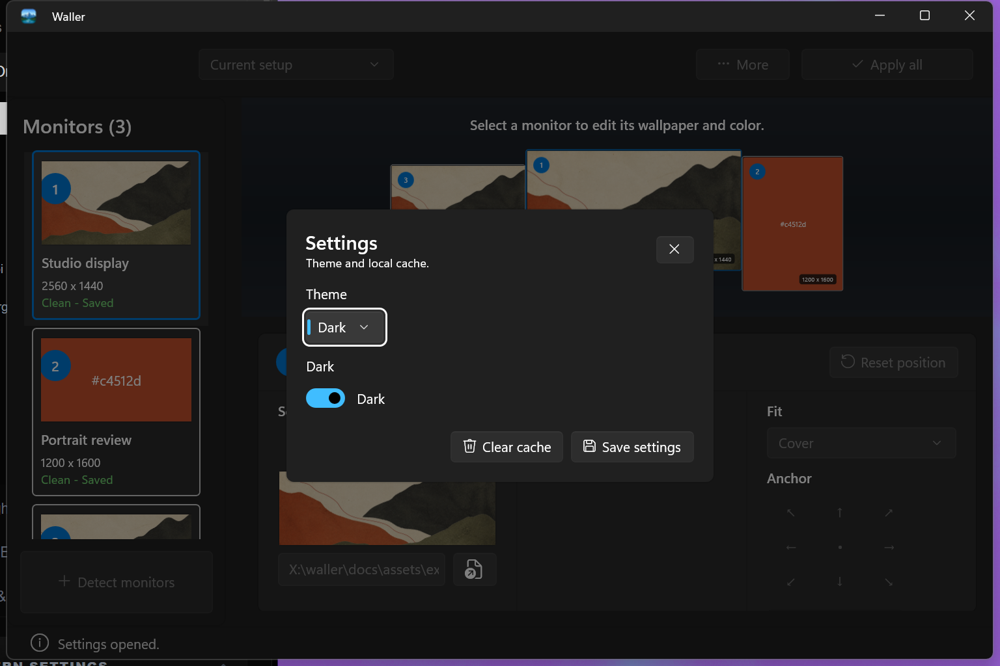
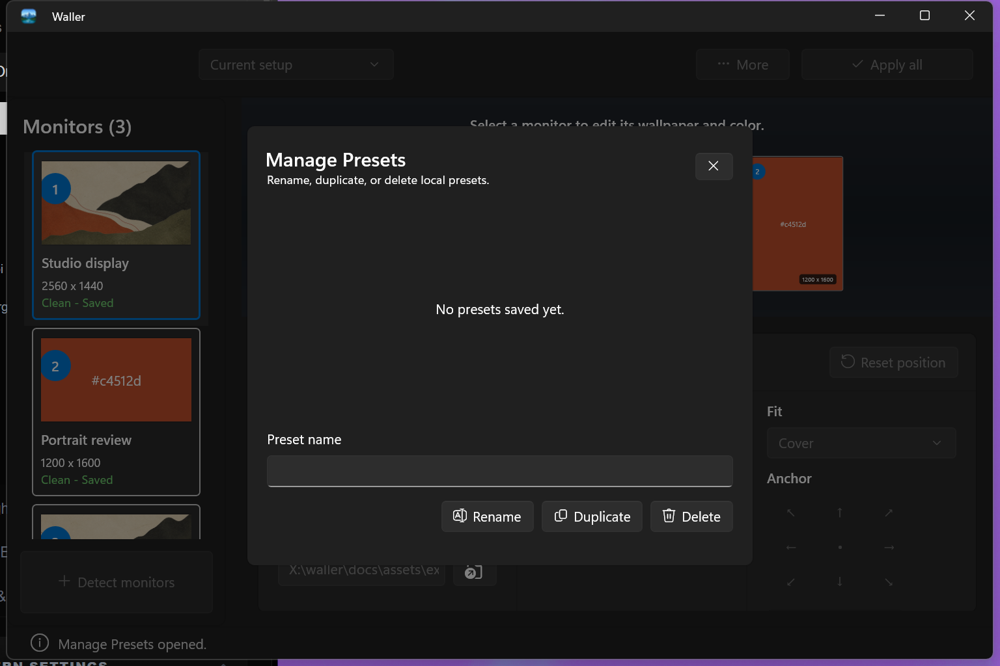
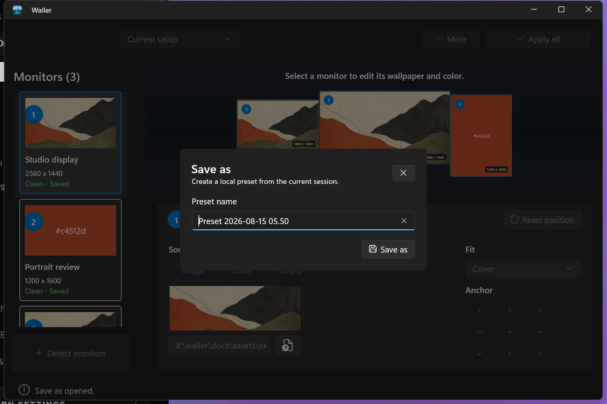

<p align="center">
  <picture>
    <source media="(prefers-color-scheme: dark)" srcset="https://shieldcn.dev/header/document.svg?title=Waller&subtitle=One+wallpaper+workspace+for+every+monitor&logo=windows&theme=orange&align=center&mode=dark" />
    
  </picture>
</p>

<p align="center">
  <a href="https://github.com/gvastethecreator/waller/actions/workflows/ci.yml"></a>
  <a href="https://gvastethecreator.github.io/waller/"></a>
  <a href="https://dotnet.microsoft.com/"></a>
  <a href="https://github.com/gvastethecreator/waller/stargazers"></a>
  <a href="LICENSE"></a>
</p>

Waller is a native Windows wallpaper manager for multi-monitor setups. The definitive product is the WinUI 3 application under `native/`, built with C# and .NET 10.

It keeps one editable **Active Session**, lets every **Monitor** use its own **Wallpaper Source** and placement, saves reusable local **Presets**, and applies rendered wallpapers through Windows `IDesktopWallpaper`.

## Current product

- Detects connected monitors and their current wallpapers.
- Supports local images, solid colors, and empty assignments.
- Supports Cover, Contain, Stretch, Center, and Tile placement.
- Saves, loads, renames, duplicates, and deletes local Presets.
- Renders one shell-readable PNG per monitor before Apply.
- Reports Apply progress and supports cancellation.
- Provides an English UI, light/dark themes, keyboard access, and packaged launch diagnostics.
- Keeps Save and Apply independent: Save persists a Preset; Apply changes Windows.

[Project site](https://gvastethecreator.github.io/waller/) · [Latest release](https://github.com/gvastethecreator/waller/releases/latest) · [Source and issues](https://github.com/gvastethecreator/waller)

## Product tour

These captures use an isolated proof package with three fictional monitors and an original matte wallpaper generated for the demo. The app never changed the real desktop or read personal presets.

| Monitor workspace | English settings |
| --- | --- |
|  |  |
| **Preset manager** | **Save a preset** |
|  |  |

See [capture provenance](docs/assets/screenshots/README.md) for the isolation boundary and example-art source.

The removed web/Tauri implementation remains available through Git history only.

## Solution map

```text
native/
  Waller.Native.App/    WinUI shell, view models, composition, and Windows adapters
  Waller.Native.Workflows/ XAML-free use cases and shell state
  Waller.Native.Core/   domain models, rendering, persistence, and Windows contracts
  Waller.Native.Tests/  xUnit tests for Core and public workflows
  scripts/              verification, smoke, packaging, and diagnostic commands
```

Dependency direction is `App -> Workflows -> Core`, with `App -> Core` for UI adapters. Tests reference Workflows and Core. Active domain language lives in [`CONTEXT.md`](./CONTEXT.md).

## Requirements

- Windows 10 version 1809 or newer
- .NET SDK `10.0.302` or a compatible patch selected by [`global.json`](./global.json)
- Developer Mode for packaged local launch

The repository can install the required SDK into `.scratch/toolchains` without changing the machine-wide installation:

```powershell
powershell -ExecutionPolicy Bypass -File .\scripts\BootstrapDotnet.ps1
```

## Run

```powershell
powershell -ExecutionPolicy Bypass -File .\scripts\Invoke-Native.ps1 -Task Run
```

The root executor uses the workspace-local SDK when present, builds the interactive run self-contained, and delegates to the canonical native scripts.

## Verify

Fast repository gate without launching the app:

```powershell
powershell -ExecutionPolicy Bypass -File .\scripts\Invoke-Native.ps1 -Task Verify -SkipSmoke
```

Packaged launch and optional UI Automation smoke:

```powershell
powershell -ExecutionPolicy Bypass -File .\scripts\Invoke-Native.ps1 -Task Verify -SurfaceSmoke -SettingsRoundTrip
```

Apply smoke temporarily changes the current user's wallpapers and restores them in `finally`. Run it only when that desktop mutation is acceptable:

```powershell
powershell -ExecutionPolicy Bypass -File .\scripts\Invoke-Native.ps1 -Task Verify -ApplySmoke
```

## Build and packaging

```powershell
powershell -ExecutionPolicy Bypass -File .\scripts\Invoke-Native.ps1 -Task Release
powershell -ExecutionPolicy Bypass -File .\scripts\Invoke-Native.ps1 -Task Package
```

`Package` creates a development-signed MSIX under `native/artifacts/`. It is for local install validation, not public distribution. Production signing, Store publication, and clean-machine qualification remain separate release gates.

## Local data

- Presets and settings use package-local `LocalCache\Local\Waller` storage.
- Rendered wallpapers use `%USERPROFILE%\.waller\rendered` so the Windows shell can read them.
- Repository cleanup and build commands do not migrate or delete user data.

## Documentation

- [`docs/INDEX.md`](./docs/INDEX.md) — active documentation map
- [`docs/DEPENDENCY_UPDATES.md`](./docs/DEPENDENCY_UPDATES.md) — current NuGet versions and changelog review
- [`docs/QUALITY_AUDIT.md`](./docs/QUALITY_AUDIT.md) — maintenance gates, evidence, and known limits
- [`docs/CHANGELOG_MAINTENANCE.md`](./docs/CHANGELOG_MAINTENANCE.md) — durable maintenance history
- [`native/docs/README.md`](./native/docs/README.md) — native architecture and operations
- [`docs/architecture/winui-definitive-architecture-spec.md`](./docs/architecture/winui-definitive-architecture-spec.md) — approved architecture specification
- [`docs/architecture/WORKPLAN.md`](./docs/architecture/WORKPLAN.md) — architecture execution tracker
- [`docs/architecture/winui-definitive-architecture-report.md`](./docs/architecture/winui-definitive-architecture-report.md) — completed ten-ticket architecture report

## Support

If Waller improves your multi-monitor setup, you can [sponsor continued development](https://github.com/sponsors/gvastethecreator) or [support the maintainer on Ko-fi](https://ko-fi.com/gvaste). Focused bug reports and improvements are welcome through [GitHub Issues](https://github.com/gvastethecreator/waller/issues) and [CONTRIBUTING.md](CONTRIBUTING.md).

## License

MIT
