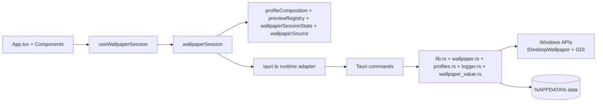
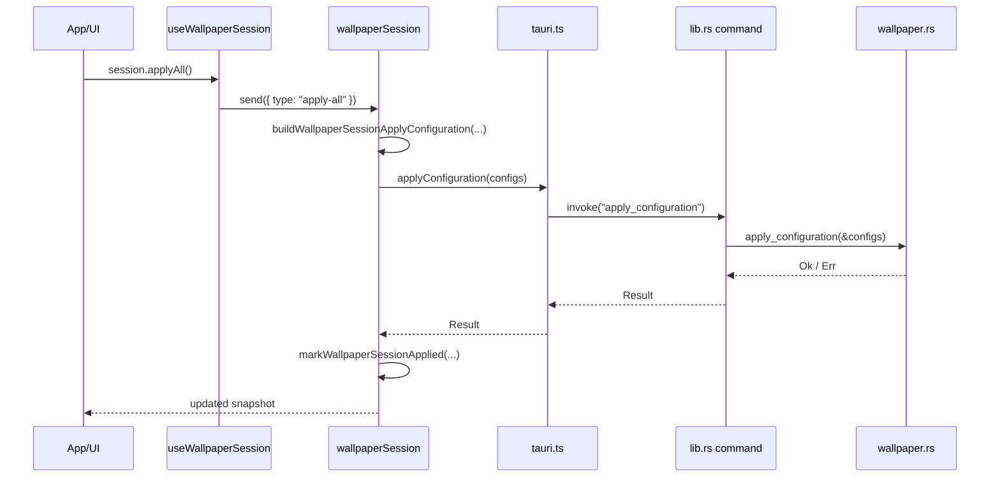
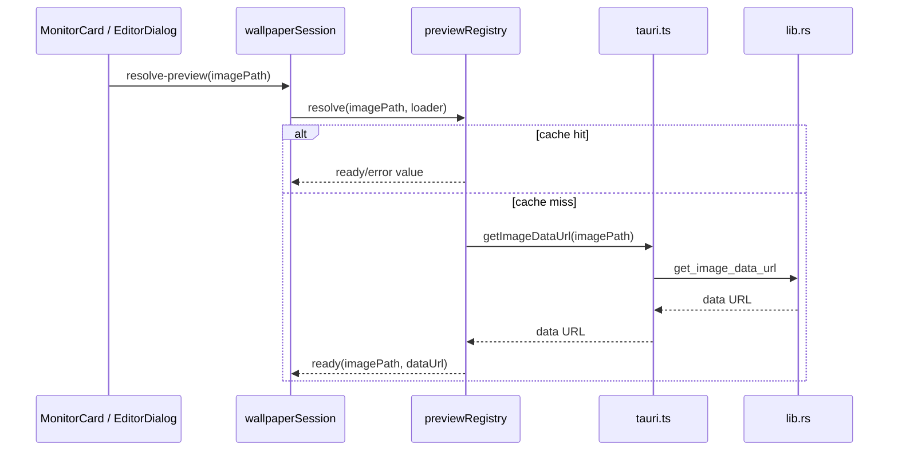

# Project Architecture

## Overview

Waller uses a hybrid desktop architecture with a deliberately narrow seam between React state and native wallpaper control:

- **Frontend shell:** `src/`
- **Frontend domain/session modules:** `src/lib/` + `src/hooks/`
- **Native backend and IPC:** `src-tauri/src/`
- **Windows integration:** `IDesktopWallpaper`, COM, and GDI through the `windows` crate

The key design goal is to keep most wallpaper behavior testable as pure TypeScript while reserving platform work for the Rust/Tauri boundary.

## Runtime layers

## Frontend seams

### UI shell

- `src/App.tsx`
  - renders the header, profile toolbar, layout overview, monitor grid, footer action, save modal, logs modal, editor dialog, and toast feedback
  - delegates wallpaper behavior to grouped actions from `useWallpaperSession`
- `src/components/MonitorCard.tsx`
  - presentational monitor editor/apply card
- `src/components/MonitorLayout.tsx`
  - overview layout of monitors
- `src/components/EditorDialog.tsx`
  - non-destructive browser-side editor and PNG export flow

### Session and pure domain modules

- `src/hooks/useWallpaperSession.ts`
  - React seam over the store
  - exposes grouped actions: `session`, `monitorDrafts`, `profiles`, `editor`, `previews`
- `src/lib/wallpaperSession.ts`
  - command queue, snapshot building, preview warming, editor flow, identify fallback logic
- `src/lib/wallpaperSessionState.ts`
  - pure draft/baseline state operations and dirty tracking
- `src/lib/profileComposition.ts`
  - profile save/load composition, validation, and active-monitor projection
- `src/lib/previewRegistry.ts`
  - deduplicated preview loading and state transitions (`loading` / `ready` / `error`)
- `src/lib/wallpaperSource.ts`
  - encode/decode/normalize wallpaper markers and fit-mode utilities
- `src/lib/tauri.ts`
  - typed IPC adapter and plugin wrappers for dialogs/logging

## Backend modules

- `src-tauri/src/lib.rs`
  - Tauri command registration
  - `run_blocking` orchestration
  - image preview/edited PNG handling
  - identify-window lifecycle
  - health-check command
- `src-tauri/src/wallpaper.rs`
  - monitor discovery
  - wallpaper application
  - COM / GDI integration
- `src-tauri/src/wallpaper_value.rs`
  - fit-mode validation and conversion
  - wallpaper marker resolution
  - solid-colour BMP generation
- `src-tauri/src/profiles.rs`
  - profile persistence and validation
- `src-tauri/src/logger.rs`
  - persistent log append/read/clear and rotation
- `src-tauri/src/error.rs`
  - typed backend error model serialized back to the UI

## Core contracts

### Wallpaper Source contract

A persisted wallpaper source is always represented as one of:

- absolute image path
- `__NONE__`
- `__SOLID__:#RRGGBB`

That contract must stay aligned between:

- `src/lib/wallpaperSource.ts`
- `src/lib/profileComposition.ts`
- `src-tauri/src/wallpaper_value.rs`
- `src-tauri/src/profiles.rs`
- `src-tauri/src/wallpaper.rs`

### Wallpaper Session contract

The **Wallpaper Session** owns:

- active monitor list
- current Wallpaper Drafts
- baseline/applied drafts
- preview state
- profile names
- editor state
- Identify Overlay state

This is the main frontend orchestration boundary and should remain the default place for multi-step wallpaper behavior.

## Important flows

### Apply-all flow

### Preview flow

## Persistence and operational data

- Profiles: `%APPDATA%/WallpaperManager/profiles/*.json`
- Logs: `%APPDATA%/WallpaperManager/logs/app.log` with `app.log.bak` rotation
- Edited PNG output: `%APPDATA%/WallpaperManager/edited/*.png`
- Solid-colour BMP cache: `%APPDATA%/WallpaperManager/cache/solid_*.bmp`

## Architectural guardrails

- Keep blocking native work behind `run_blocking` / `spawn_blocking`.
- Keep Tauri IPC concentrated in `src/lib/tauri.ts`.
- Keep shared value semantics synchronized across TypeScript and Rust.
- Keep the project Windows-only unless a task explicitly changes that constraint.
