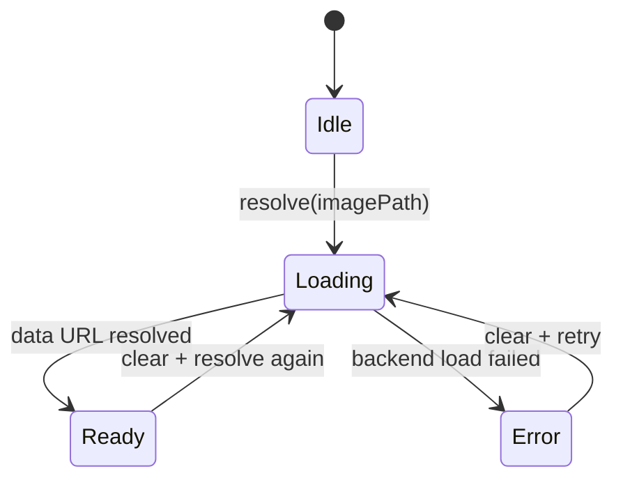
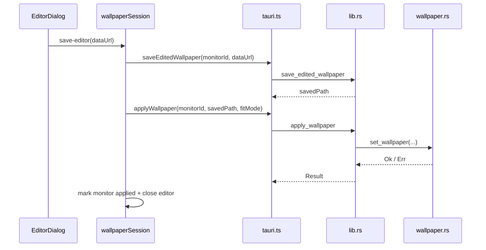

# Implementation Details

## Frontend (`src/`)

### `App.tsx`

`App.tsx` is now primarily a composition shell. It:

- wires grouped actions from `useWallpaperSession`
- manages transient UI state such as the selected profile name, save/logs modals, and toast feedback
- initializes frontend logging
- captures `error` and `unhandledrejection` events for observability
- renders `MonitorLayout`, `MonitorCard`, and `EditorDialog`
- applies a lightweight GSAP entrance animation to monitor cards

The heavy wallpaper logic is intentionally delegated away from the component tree.

### `useWallpaperSession.ts`

This is the React seam over the store. It exposes:

- `session`
   - `refresh`
   - `applyAll`
   - `identify`
- `monitorDrafts`
   - choose image
   - set source type
   - set solid colour
   - set fit mode
   - clear
   - apply one monitor
- `profiles`
   - load
   - save
   - delete
- `editor`
   - open
   - pick image
   - save
   - close
- `previews`
   - resolve preview data URLs

Flat aliases are still exposed for compatibility with older callers.

### `wallpaperSession.ts`

This module is the frontend orchestration core. It implements:

- a queued command processor (`send(...)`) so multi-step wallpaper operations stay serialized
- snapshot building for the UI
- monitor sorting and view projection
- preview warming for visible image sources
- profile load/save flows
- editor save/apply flow
- identify fallback animation when native identify windows fail

The store keeps these state slices together:

- monitor list
- draft state / baseline state
- profiles list
- editor state
- Identify Overlay state

### `wallpaperSessionState.ts`

Pure state helpers for:

- creating the initial draft state
- refreshing drafts when monitors change
- updating a monitor draft
- replacing drafts from a loaded profile
- setting a global fit mode
- determining per-monitor and whole-session dirty state
- building apply payloads
- marking one monitor or all monitors as applied

This module is intentionally free of IPC and DOM concerns.

### `profileComposition.ts`

Owns the profile persistence rules:

- trim and validate profile name
- validate monitor count and image-path length
- validate fit modes before save
- compose a save payload from current drafts
- project a loaded profile onto currently active monitors only

### `previewRegistry.ts`

Provides a dedicated mini state machine for preview loading.

States:

- `loading`
- `ready`
- `error`

Its main job is to deduplicate concurrent preview requests so the same image path is not loaded multiple times in parallel.

### Preview state flow

### `wallpaperSource.ts`

Encodes and decodes the persisted wallpaper-source shapes used across the app:

- plain image path
- `__NONE__`
- `__SOLID__:#RRGGBB`

It also normalizes fit modes and provides draft snapshots used when applying or saving.

### `tauri.ts`

This is the frontend IPC adapter layer. It:

- wraps `invoke(...)` with consistent error normalization
- wraps Tauri dialog and log plugins
- exposes typed functions for monitors, profiles, previews, editor saves, and health check
- exports `tauriWallpaperSessionRuntime`, which satisfies the `WallpaperSessionRuntime` interface used by the store

## Backend (`src-tauri/src/`)

### `lib.rs`

`lib.rs` is the backend command boundary and runtime wiring. It is responsible for:

- registering Tauri commands
- serializing wallpaper operations with an `AppState` mutex
- running blocking work through `run_blocking`
- exposing preview loading (`get_image_data_url`)
- storing edited PNGs (`save_edited_wallpaper`)
- identifying monitors with temporary overlay windows
- providing `health_check`

### `wallpaper.rs`

Native wallpaper/monitor integration:

- initializes COM safely
- queries monitor identity and geometry
- maps fit modes to `DESKTOP_WALLPAPER_POSITION`
- applies wallpaper per monitor or in batch
- uses marker resolution supplied by `wallpaper_value.rs`

### `wallpaper_value.rs`

Centralizes native value semantics:

- validates fit-mode strings
- converts fit strings to Win32 positions and back
- resolves `__NONE__` / `__SOLID__:*` marker behavior
- generates solid-colour BMP payloads for cached application

### `profiles.rs`

Implements local profile persistence:

- validates profile names and monitor payloads
- sanitizes filenames
- reads/writes JSON profile files
- lists and deletes saved profiles

### `logger.rs`

Implements persistent observability:

- append-only log writes with epoch timestamp and scope
- read/clear functions for the UI
- rotate-at-2-MiB behavior through `app.log.bak`

## Editor save/apply flow

## Configuration and automation

- `.vscode/tasks.json`
   - development, build, smoke-test, check, and full verification tasks
- `package.json`
   - root scripts for verify/build/dependency maintenance
- `scripts/check-tauri-version-sync.mjs`
   - guards JS/Rust Tauri version alignment
- `src-tauri/tauri.conf.json`
   - application, window, CSP, and build settings
