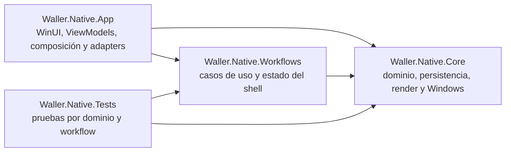

# Informe final: arquitectura definitiva de Waller WinUI

## Resultado

WinUI 3 es el único producto activo de Waller. La línea web/Tauri y el prototipo
WinUI duplicado salieron del árbol activo; su historia queda en Git. La solución
nativa tiene ahora cuatro módulos con ownership explícito: App, Workflows, Core
y Tests.

Los 10 tickets aprobados están completos. La integración final pasó con 517/517
pruebas, todos los guardas estáticos, smokes empaquetados y build Release x64 sin
advertencias ni errores.

## Arquitectura resultante



`WallerAppComposition` crea un solo grafo por proceso. `ShellWorkspace` es dueño
de Active Session, modales y el lease exclusivo de Apply. Los workflows no
dependen de XAML y la UI proyecta resultados técnicos mediante ViewModels
enfocados.

## Las 10 mejoras entregadas

| Ticket | Cambio entregado | Valor obtenido | Evidencia principal |
|---|---|---|---|
| ARC-01 | WinUI promovido a raíz; Tauri y prototipo retirados | Un producto, un toolchain, un CI y un release | Gate raíz, 470 pruebas iniciales, Release x64 |
| ARC-02 | Nuevo módulo Workflows y `ShellWorkspace` | Ownership único de sesión, modales y concurrencia Apply | 8 transiciones públicas; 478 pruebas integradas |
| ARC-03 | `WallerAppComposition` como composition root | Ventana y página comparten el mismo grafo; sin globals de HWND/dispatcher | Guarda de composición y packaged launch |
| ARC-04 | `LocalDataLayout` tipado | Política ejecutable para JSON privado y PNG legible por Shell | 9 escenarios y Settings roundtrip |
| ARC-05 | `UserSettingsWorkflow` FIFO | Un solo escritor; no se pisan theme, idioma, Preset ni geometría | 6 escenarios y guarda de single-writer |
| ARC-06 | `WindowPlacementWorkflow` observable | Restore previo a activar; close guarda una vez y termina | 5 escenarios y lifecycle smoke |
| ARC-07 | `PresetWorkflow` + `PresetsViewModel` | Catálogo, selección y mutaciones fuera del ViewModel raíz | 5 escenarios y surface smoke |
| ARC-08 | `MonitorEditorWorkflow` + `MonitorEditorViewModel` | Edición, validación, Forget y Reassign con outcomes tipados | 7 escenarios y editor smoke 4/4 |
| ARC-09 | `ApplyWorkflow` + `ApplyViewModel` | Ejecución/cancelación única, fallas parciales y UI localizada separadas | 7 escenarios y Release x64 |
| ARC-10 | Pruebas por dominio y guardas estructurales | Menos acoplamiento a snippets; ownership verificable | 9 módulos Core, 7 suites Workflows, gate final completo |

## Limpieza realizada

- Retirados `src/`, `src-tauri/`, manifests Node/Rust y la automatización Tauri.
- Retirado `prototypes/winui-native/`; la solución canónica vive en `native/`.
- Retirados helpers y partials raíz reemplazados por workflows y child ViewModels.
- `SampleMonitorDetector` salió de producción y vive solo como fixture de Tests.
- `CoreArchitectureTests.cs` se dividió por dominio sin perder sus 359 métodos de prueba.
- La limpieza no migra ni elimina Presets, Settings o wallpapers del usuario.

## Verificación final

Comando ejecutado una sola vez sobre el estado final:

```powershell
powershell -ExecutionPolicy Bypass -File .\scripts\Invoke-Native.ps1 -Task Verify -SurfaceSmoke -SettingsRoundTrip -ApplySmoke -ReleaseBuild -DisableNuGetAudit -Platform x64
```

| Gate | Resultado |
|---|---|
| Guardas XAML, localización, composición, workflows, Core, JSON, package, firma y seguridad | pass |
| Build Debug de solución | pass, 0 warnings, 0 errors |
| xUnit | 517 passed, 0 failed, 0 skipped |
| Packaged launch | pass; proceso respondiendo con título `Waller` |
| Window lifecycle | pass; restore/save/destroy y proceso terminado |
| Surface smoke | Shell 5/5, editor 4/4, Settings 5/5, Save As 3/3, Manage 6/6 |
| Settings roundtrip | pass; `Theme=1`, `Language=es`, archivo restaurado |
| Apply smoke | pass; 3 succeeded, 0 failed, 3 paths changed, 3 monitors restored |
| Release x64 | pass, 0 warnings, 0 errors |

El Apply smoke ahora restaura tanto escritorios con imágenes como escritorios
completamente de color sólido. Un estado mixto imagen/color sólido se rechaza
antes de mutar el escritorio porque no puede restaurarse con certeza usando el
contrato disponible.

## Riesgo residual

Estos gates no se ejecutaron en este host y no se presentan como aprobados:

- publicación en Microsoft Store;
- firma de producción;
- instalación y actualización en máquina limpia;
- runtime ARM64.

La prueba local cubrió x64. Los contratos de package y firma sí pasaron sus
guardas estáticas, pero no sustituyen esos gates externos.

## Estado de entrega

- Especificación: completada.
- Tickets: ARC-01 a ARC-10 completados.
- Workplan: cerrado.
- Commit, push y PR: no realizados; no fueron autorizados.
