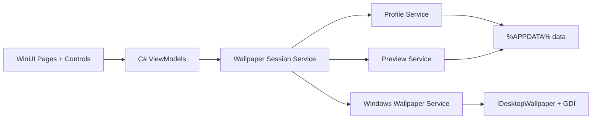

# WinUI Migration Effort Report

## Executive Answer

Migrating Waller from Tauri/React/Rust to a WinUI 3 native app is feasible, but it is not a small wrapper change. The expected effort is **3 to 6 weeks for functional parity** with one focused developer, or **5 to 8 weeks for a polished release candidate** with native packaging, diagnostics, and regression coverage.

The fastest useful path is not a big-bang rewrite. Build a WinUI app in slices, keep the current Tauri app stable, and port only the smallest vertical flow first: monitor detection, wallpaper source selection, and apply-all.

## Current Evidence

| Area | Current implementation | Migration impact |
|---|---|---|
| Shell/UI | React components, Tailwind CSS, GSAP animation | Rewrite in XAML/WinUI |
| State/session | TypeScript store and React hook | Port to C# ViewModels/services |
| Native wallpaper API | Rust with `windows` crate over COM/GDI | Reuse as reference or port to C# |
| Profiles/logging | Rust filesystem modules | Straightforward C# port |
| Image editor | Browser canvas | Highest-cost native rewrite |
| Packaging | Tauri build/release | Replace with WinUI/MSIX workflow |

Relevant size snapshot:

| Area | Files | Approx. lines |
|---|---:|---:|
| UI components/hooks | 10 | 1,208 |
| Frontend domain/session modules | 14 | 1,752 |
| Rust backend modules | 7 | 1,458 |
| CSS | 1 main file | 415 |

The codebase is well separated, which lowers risk. The current seams in `wallpaperSession`, `tauri.ts`, and `src-tauri/src/wallpaper.rs` map cleanly to WinUI services and ViewModels.

## Recommended Scope

### MVP Migration

Target: prove that the app can be useful as WinUI without matching every feature.

Included:

- WinUI main window and native layout.
- Monitor detection.
- Per-monitor wallpaper source draft.
- Image path selection.
- Fit mode selection.
- Apply selected monitor.
- Apply all monitors.
- In-memory or simple JSON profile save/load.
- Basic status and error messages.

Excluded:

- Image editor.
- Identify overlay polish.
- Full logging UI.
- Import/export profiles.
- Release packaging hardening.

Estimate: **2 to 3 weeks**.

### Functional Parity Migration

Target: match the current Tauri app's day-to-day feature set.

Included:

- Everything in MVP.
- Persistent profiles in `%APPDATA%/WallpaperManager/profiles`.
- Persistent logs and log viewer.
- Identify overlay windows.
- Preview loading/caching.
- Health check equivalent.
- Spanish/English UI strings.
- Focused unit tests for profile/session/wallpaper-source behavior.

Estimate: **3 to 6 weeks**.

### Release Candidate

Target: ship WinUI as the primary app.

Included:

- Functional parity.
- Native image editor or deliberate WebView-based editor bridge.
- MSIX signing and install/update workflow.
- Manual multi-monitor test matrix.
- Accessibility pass.
- Error handling and diagnostics pass.
- Migration notes for existing profile data.

Estimate: **5 to 8 weeks**.

## Work Breakdown

| Workstream | Effort | Notes |
|---|---:|---|
| WinUI project/tooling | 1-2 days | Prototype proved build/run shape, but runtime/tooling setup needs documentation |
| Native shell layout | 3-5 days | Rebuild header, profile toolbar, monitor list/grid, footer actions |
| Session state port | 4-7 days | Port `wallpaperSession`, dirty tracking, command queue, profile composition |
| Windows wallpaper service | 3-6 days | C# COM/GDI port or Rust interop boundary |
| Profile/log services | 2-3 days | JSON and log files are straightforward |
| Preview pipeline | 2-4 days | Native image load, data binding, caching, file limits |
| Identify overlay | 2-4 days | Multi-window placement and always-on-top behavior |
| Image editor | 1-3 weeks | Biggest unknown; native canvas/filter/export work is not trivial |
| Tests/manual QA | 4-8 days | Multi-monitor cases require real Windows validation |
| Packaging/release | 3-6 days | MSIX, signing, runtime dependencies, install docs |

## Reuse Strategy

| Current asset | Reuse level | Recommendation |
|---|---|---|
| Domain vocabulary | High | Keep Monitor, Wallpaper Session, Profile, Preview terms |
| Profile JSON contract | High | Preserve for migration compatibility |
| Wallpaper source markers | High | Keep `__NONE__` and `__SOLID__:#RRGGBB` |
| Rust backend code | Medium | Use as implementation reference; porting to C# is likely simpler than Rust FFI |
| TypeScript session tests | Medium | Translate key cases to C# tests |
| React components | Low | Rebuild as XAML; do not try to reuse |
| CSS/theme | Low/Medium | Reuse visual intent, not implementation |
| Browser canvas editor | Low | Rebuild native later or isolate in WebView2 temporarily |

## Architecture Direction

Recommended WinUI shape:

The important migration choice is the native boundary:

| Option | Pros | Cons | Recommendation |
|---|---|---|---|
| Port Rust backend to C# | Simpler debugging, one runtime, natural WinUI integration | Must carefully reproduce COM/GDI behavior | Best default |
| Keep Rust as DLL/CLI | Reuses existing tested code | Adds interop, packaging, logging, async complexity | Only if Rust code grows much larger |
| Keep Tauri backend and replace UI | Avoids backend port | Awkward hybrid, weakens the point of WinUI | Not recommended |

## Main Risks

| Risk | Severity | Mitigation |
|---|---|---|
| Windows App Runtime/tooling friction | High | Document setup, pin known-good SDK/runtime, keep `BuildAndRun.ps1` |
| Multi-monitor behavior differs across machines | High | Test real setups: one monitor, mixed DPI, negative coordinates, disconnected display |
| Image editor grows into a mini image app | High | Defer editor until core migration is proven |
| Losing current profile compatibility | Medium | Keep JSON schema and marker contracts unchanged |
| XAML data-binding bugs | Medium | Prefer simple ViewModels, observable collections, and focused UI smoke tests |
| Packaging/signing surprises | Medium | Start MSIX validation before the end, not after feature parity |

## Phase Plan

### Phase 0: Prototype Baseline

Status: started in `prototypes/winui-native`.

Done:

- WinUI MVVM scaffold.
- Waller-shaped mock shell.
- Build script adjusted to find local `winapp`.
- Runtime blocker identified and resolved on the development machine.

Exit criteria:

- Prototype launches reliably from `BuildAndRun.ps1`.
- One mock apply flow can be replaced by a real wallpaper service.

### Phase 1: Real Native Slice

Goal: one monitor can be detected and updated from WinUI.

Tasks:

- Add `WallpaperService`.
- Port monitor model.
- Port `get_monitors`.
- Port `apply_wallpaper`.
- Replace mock monitor list with real data.
- Keep profiles and editor out of scope.

Estimate: **3 to 5 days**.

### Phase 2: Session and Profiles

Goal: everyday wallpaper management without editor.

Tasks:

- Port draft/baseline state.
- Port apply-all composition.
- Port profile save/load/list/delete.
- Add native file picker.
- Add basic log/status surface.

Estimate: **1 to 2 weeks**.

### Phase 3: Parity Features

Goal: match current Tauri app except advanced editor polish.

Tasks:

- Add preview service.
- Add identify overlay windows.
- Add health check.
- Add i18n structure.
- Add tests around source markers, profiles, and session transitions.

Estimate: **1 to 2 weeks**.

### Phase 4: Editor Decision

Goal: choose the least risky editor path.

Options:

- Native editor with Win2D/WriteableBitmap.
- Temporary WebView2 editor hosted inside WinUI.
- Remove editor from initial WinUI release and keep it on the roadmap.

Estimate:

- WebView2 bridge: **3 to 5 days**.
- Native editor: **1 to 3 weeks**.

### Phase 5: Release Hardening

Goal: make WinUI safe to ship.

Tasks:

- MSIX signing/package checks.
- Runtime dependency documentation.
- Existing profile migration verification.
- Manual multi-monitor matrix.
- Accessibility and keyboard navigation pass.
- Error/logging polish.

Estimate: **1 to 2 weeks**.

## Decision

Proceed with WinUI only if the goal is a genuinely native Windows app and the team accepts a **minimum 3 to 6 week migration** before parity. If the goal is only better packaging or launch reliability, improving the current Tauri app is cheaper.

Recommended next move: finish Phase 1 in the prototype branch. If real monitor detection and apply-one work cleanly in WinUI, the migration is worth planning as a staged rewrite. If Phase 1 is painful, keep Tauri and spend effort on release hardening instead.
