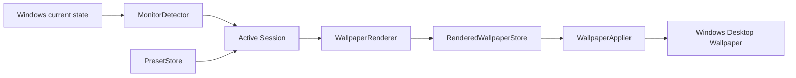
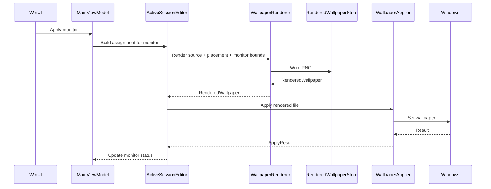

# Waller Native Architecture

Date: 2026-06-04

This document describes the target architecture for the fresh WinUI/.NET version of Waller. It reflects the decisions in `PRODUCT_DECISIONS.md` and the GitHub research in `GITHUB_RESEARCH_REPORT.md`.

## Architecture Summary

Waller Native should be built as a Windows-only .NET solution with a WinUI app, a Windows-aware Core project, and Core tests.

Target solution:

```text
Waller.Native.sln
  Waller.Native.App
  Waller.Native.Core
  Waller.Native.Tests
```

Project responsibilities:

| Project | Responsibility |
|---|---|
| Waller.Native.App | WinUI/XAML, ViewModels, file picker, windows, modals, edit panel, localization UI glue |
| Waller.Native.Core | domain models, Active Session, Presets, monitor matching, placement, renderer, rendered cache, wallpaper apply |
| Waller.Native.Tests | Core behavior tests with fake adapters and fixtures |

Decision:

`Waller.Native.Core` is Windows-only. The app is a Windows wallpaper tool, and pretending Core is cross-platform would add complexity without leverage.

## Recommended Packages

MVP packages:

| Package | Use |
|---|---|
| CommunityToolkit.Mvvm | ViewModels, observable properties, commands |
| Microsoft.Windows.CsWin32 | Strongly typed Windows interop for wallpaper and monitor APIs |
| Microsoft.WindowsAppSDK | WinUI 3 / Windows App SDK |

Avoid in the first slice:

- Win2D
- SkiaSharp
- MagicScaler
- ImageSharp
- WinUIEx
- Vanara
- DesktopManager
- Template Studio

Reason:

The first slice should prove monitor detection, current wallpaper read, render, and apply. Image/editor/window helper dependencies can wait.

## Native Interop Direction

Use C#/.NET with CsWin32 for Windows interop.

Do not keep Rust as a permanent dependency.

Rust code from the current Tauri app remains useful as behavioral reference, especially:

```text
src-tauri/src/wallpaper.rs
src-tauri/src/wallpaper_value.rs
src-tauri/src/profiles.rs
```

But the target WinUI app should implement the native modules in C#.

Avoid C/C++ unless a future library proves it is clearly worth the cost.

## High-Level Flow



## App Structure

Suggested `Waller.Native.App` folders:

```text
Waller.Native.App/
  App.xaml
  MainWindow.xaml
  Views/
    MainPage.xaml
    MonitorEditPanel.xaml
    ManagePresetsDialog.xaml
    SettingsDialog.xaml
  ViewModels/
    MainViewModel.cs
    MonitorRowViewModel.cs
    MonitorEditViewModel.cs
    PresetMenuViewModel.cs
    ManagePresetsViewModel.cs
    SettingsViewModel.cs
  Localization/
    Strings.en.resw
    Strings.es.resw
  Platform/
    FilePickerAdapter.cs
    WindowPlacementAdapter.cs
```

The App project should not own placement math, render logic, Preset persistence, or Windows wallpaper application. It should call Core modules.

## Core Structure

Suggested `Waller.Native.Core` folders:

```text
Waller.Native.Core/
  Models/
    ActiveSession.cs
    MonitorIdentity.cs
    MonitorSnapshot.cs
    MonitorBounds.cs
    Preset.cs
    PresetAssignment.cs
    WallpaperSource.cs
    WallpaperPlacement.cs
    RenderedWallpaper.cs
    ApplyResult.cs
  Sessions/
    ActiveSessionFactory.cs
    ActiveSessionEditor.cs
    ApplyPlanner.cs
  Presets/
    PresetStore.cs
    PresetMatcher.cs
    PresetSerializer.cs
  Rendering/
    WallpaperRenderer.cs
    RenderedWallpaperStore.cs
  Windows/
    MonitorDetector.cs
    WallpaperApplier.cs
    DesktopWallpaperInterop.cs
  Settings/
    UserSettingsStore.cs
  Contracts/
    NativeMethods.txt
```

## Core Models

### ActiveSession

Represents the editable current state of the app.

Suggested shape:

```csharp
public sealed record ActiveSession(
    IReadOnlyList<MonitorSession> Monitors,
    PresetIdentity? BasedOnPreset,
    bool HasUnsavedPresetChanges
);
```

### MonitorSession

Represents one active monitor in the current session.

Suggested fields:

```text
MonitorSnapshot Monitor
PresetAssignment DesiredAssignment
PresetAssignment? LastAppliedAssignment
MonitorApplyStatus ApplyStatus
string? ApplyError
bool HasUnsavedPresetChanges
```

### MonitorSnapshot

Represents a monitor detected from Windows.

Suggested fields:

```text
MonitorIdentity Identity
string DisplayName
int DisplayIndex
MonitorBounds Bounds
WallpaperSource CurrentSource
```

### MonitorIdentity

Represents stable identity plus fallback metadata.

Suggested fields:

```text
string MonitorKey
string? DeviceName
int DisplayIndex
int Width
int Height
int X
int Y
```

Matching rules:

1. exact `MonitorKey`
2. resolution + approximate position
3. missing/disconnected

### Preset

Represents a local saved snapshot.

Suggested fields:

```text
int SchemaVersion
Guid Id
string Name
IReadOnlyList<PresetAssignment> Assignments
DateTimeOffset CreatedAt
DateTimeOffset UpdatedAt
```

### PresetAssignment

Represents the intended wallpaper state for a monitor.

Suggested fields:

```text
MonitorIdentity SavedMonitor
WallpaperSource Source
WallpaperPlacement Placement
```

### WallpaperSource

Suggested shape:

```csharp
public enum WallpaperSourceKind
{
    Image,
    SolidColor,
    Empty
}

public sealed record WallpaperSource(
    WallpaperSourceKind Kind,
    string? ImagePath,
    string? ColorHex
);
```

Validation:

- `Image` requires a non-empty path.
- `SolidColor` requires valid `#RRGGBB`.
- `Empty` ignores path/color and renders black.

### WallpaperPlacement

Suggested shape:

```csharp
public enum WallpaperFitMode
{
    Cover,
    Contain,
    Stretch,
    Center,
    Tile
}

public enum WallpaperAnchor
{
    TopLeft,
    Top,
    TopRight,
    Left,
    Center,
    Right,
    BottomLeft,
    Bottom,
    BottomRight
}

public sealed record WallpaperPlacement(
    WallpaperFitMode FitMode,
    WallpaperAnchor Anchor
);
```

No MVP fields:

- offset X/Y
- zoom
- rotation
- filters

### RenderedWallpaper

Represents the file that Windows will receive.

Suggested fields:

```text
MonitorIdentity Monitor
string Path
int Width
int Height
DateTimeOffset CreatedAt
```

Output format:

```text
PNG
```

## Core Modules

### ActiveSessionFactory

Creates an Active Session from current Windows state.

Interface intent:

```text
Load current monitors
Read current wallpaper source per monitor
Create editable MonitorSession list
Do not apply anything
Do not load Preset automatically
```

### PresetStore

Owns local Preset persistence.

Root:

```text
%LOCALAPPDATA%/Waller/presets
```

Responsibilities:

- list Presets
- load Preset
- save Preset
- rename Preset
- duplicate Preset
- delete Preset
- preserve schemaVersion

Implementation:

- JSON files managed by the app.
- No manual import/export in MVP.

### PresetMatcher

Applies a Preset to the current Active Session without touching Windows.

Responsibilities:

- match assignments to active monitors
- preserve missing assignments
- leave new monitors in current Windows state
- mark session as based on Preset
- compute modified/dirty state

### WallpaperRenderer

Renders final PNG output per monitor.

Inputs:

- Monitor bounds.
- Wallpaper Source.
- Wallpaper Placement.

Outputs:

- `RenderedWallpaper` PNG file.

Rules:

- Render only on Apply.
- Black background for Empty, Contain bands, and Center extra area.
- Apply anchor rules for Cover/Contain/Center.
- Write output into rendered cache.

### RenderedWallpaperStore

Owns rendered output storage.

Root:

```text
%LOCALAPPDATA%/Waller/rendered
```

Responsibilities:

- produce stable output paths
- write PNG files
- clear cache manually from Settings

No MVP:

- automatic cleanup
- retention policy
- max cache size

### WallpaperApplier

Applies rendered PNG files to Windows.

Production adapter:

```text
WindowsDesktopWallpaperApplier
```

Test adapter:

```text
FakeWallpaperApplier
```

This seam is real because tests need a fake adapter and production needs Windows interop.

Responsibilities:

- validate monitor key
- apply PNG path per monitor
- set Windows wallpaper mode to a stable fill/stretch mode if needed
- return per-monitor result

Important:

Do not rely on Windows `SetPosition` for per-monitor placement. Waller controls placement through prerendered PNGs.

### MonitorDetector

Detects current monitor topology and current wallpaper state.

Production adapter:

```text
WindowsMonitorDetector
```

Test adapter:

```text
FakeMonitorDetector
```

Responsibilities:

- enumerate monitors through `IDesktopWallpaper`
- read monitor device path
- read monitor rectangle
- read current wallpaper
- collect fallback monitor geometry if needed
- preserve negative coordinates
- preserve monitor bounds in pixels

Candidate APIs:

```text
IDesktopWallpaper
EnumDisplayMonitors
GetMonitorInfo
GetSystemMetrics
GetDpiForWindow
GetDpiForMonitor
DisplayArea
```

### UserSettingsStore

Stores app preferences.

Path:

```text
%LOCALAPPDATA%/Waller/settings.json
```

MVP settings:

- theme
- language
- window size
- window position
- last selected Preset for visual memory only

Rule:

Never auto-load or auto-apply a Preset on startup because it was last selected.

## Apply Pipeline

### Apply Monitor



### Apply All

Rules:

- Iterate monitors.
- Render each target monitor.
- Apply each rendered file.
- Track result per monitor.
- Do not rollback successful monitors if another monitor fails.
- Preserve desired Active Session state after failures.

## Preset Flow

### Selecting a Preset

```text
Select Preset
-> load Preset JSON
-> match assignments against active monitors
-> update Active Session desired assignments
-> show missing monitors
-> do not touch Windows
```

### Saving a Preset

```text
Save
-> serialize current Active Session as Preset
-> update Preset file
-> clear unsaved Preset dirty state
-> do not touch Windows
```

### Save As

```text
Save as
-> prompt for name
-> create new Preset id
-> serialize current Active Session
-> set session BasedOnPreset to new Preset
```

## UI Architecture

### Main Window

Single-screen app.

Structure:

```text
Header command bar
Monitor topology strip
Monitor list
Right edit panel
Manage Presets modal
Settings modal
```

### MainViewModel

Responsibilities:

- expose Preset dropdown state
- expose monitor rows
- expose selected monitor
- open/close edit panel
- call Core modules for load/apply/save
- expose inline status

MainViewModel should not:

- calculate placement render geometry
- write Preset JSON
- call `IDesktopWallpaper`
- write rendered PNG files

### MonitorRowViewModel

Responsibilities:

- display monitor summary
- display source summary
- display placement summary
- display apply/save status
- expose Edit and Apply commands

### MonitorEditViewModel

Responsibilities:

- edit source kind
- choose image
- edit color
- edit fit mode
- edit anchor
- validate missing source

Changes update the Active Session immediately but do not apply to Windows.

### ManagePresetsViewModel

Responsibilities:

- list Presets
- rename
- duplicate
- delete

No import/export in MVP.

### SettingsViewModel

Responsibilities:

- theme
- language
- clear rendered cache

## Localization

MVP supports English and Spanish.

Preferred implementation:

- `.resw` resources if straightforward.

Fallback:

- simple string provider.

Keep localization in the App project unless Core needs domain error messages. Core can return error codes and structured details that App localizes.

## Error Model

Core should return structured errors rather than UI text.

Suggested shape:

```text
ErrorCode
Message/detail for diagnostics
MonitorKey if monitor-specific
Exception if internal
```

UI maps errors to localized text.

Important monitor-specific errors:

- missing source image
- missing monitor
- render failed
- apply failed
- Windows wallpaper interop failed

## Testing Strategy

`Waller.Native.Tests` should focus on Core.

Test areas:

- Preset serialization.
- Preset matching exact monitor key.
- Preset matching by resolution/position fallback.
- Missing monitor preservation.
- New monitor behavior.
- Missing source behavior.
- Placement calculations.
- Render path planning.
- Apply all partial failure.
- Save vs Apply independence.
- User settings persistence.

Use fake adapters:

- `FakeMonitorDetector`
- `FakeWallpaperApplier`
- fake filesystem or temp directory adapter if useful

Golden fixture candidates:

```text
fixtures/
  presets/
    valid-single-monitor.json
    valid-multi-monitor.json
    missing-monitor.json
  monitors/
    single-monitor.json
    dual-monitor-negative-x.json
    mixed-resolution.json
```

## Implementation Slices

### Slice 1: Shell and Active Session

Goal:

- Waller.Native solution exists.
- App launches.
- Core creates Active Session from fake monitors.
- UI shows topology strip and monitor rows.
- Right edit panel edits in-memory assignments.

No Windows wallpaper changes yet.

### Slice 2: Real Monitor Detection

Goal:

- `WindowsMonitorDetector` reads real monitors.
- Active Session starts from current Windows state.
- UI shows real monitor bounds and current wallpaper paths.

No apply yet.

### Slice 3: Renderer

Goal:

- Render PNG for Image / SolidColor / Empty.
- Implement Cover / Contain / Stretch / Center / Tile.
- Implement 3x3 anchor.
- Write to `%LOCALAPPDATA%/Waller/rendered`.

### Slice 4: Apply Monitor and Apply All

Goal:

- Apply one rendered wallpaper.
- Apply all rendered wallpapers.
- Track per-monitor result.
- Support partial failures.

### Slice 5: Presets

Goal:

- Save as Preset.
- Select Preset into Active Session.
- Save changes.
- Rename / Duplicate / Delete.
- Missing/new monitor behavior.

### Slice 6: Settings and i18n

Goal:

- Theme.
- Language.
- Window size/position.
- Clear rendered cache.

### Slice 7: Polish

Goal:

- Inline apply progress.
- Missing source UX.
- Empty state copy.
- Accessibility pass.
- Keyboard navigation pass.

## Decisions to Record as ADRs

Create ADRs for:

1. C#/.NET WinUI architecture instead of Rust/Tauri.
2. Core is Windows-only.
3. Per-monitor placement is implemented through prerendered PNG output.
4. Presets are local JSON in `%LOCALAPPDATA%/Waller`.
5. Apply and Save are independent actions.

## Known Future Questions

- Should the renderer use built-in .NET drawing, Win2D, SkiaSharp, or another library?
- Should source images ever be copied into app data?
- Should cache cleanup become automatic?
- Should Span return as a separate virtual-desktop mode?
- Should there be a portable mode?
- Should there be a tray app/minimize behavior?
